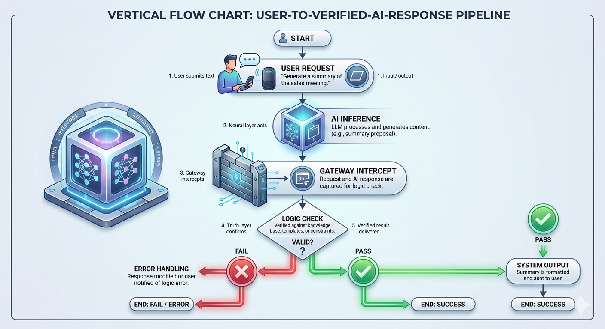

# Technical Architecture: NSAI Deterministic Gateway

## 1. Overview
The **nsai-deterministic-gate** addresses the fundamental flaw in Large Language Models (LLMs): **Stochasticity**. In mission-critical enterprise systems, probabilistic outputs (Neural) must be governed by deterministic rules (Symbolic). 

This framework implements a **Neuro-Symbolic Bridge** that decouples "Intent Discovery" from "Logic Enforcement."

---

## 2. The Logic Flow (Sequence Diagram)
Below is the choreography of the interception. The gateway ensures that no AI proposal reaches the end-user without a "Symbolic Signature" of truth.

```mermaid
sequenceDiagram
    participant U as End User
    participant A as @NSDeterministicGate
    participant N as Neural Layer (LLM)
    participant S as Symbolic Layer (Truth)

    U->>A: Invoke AI Service
    A->>N: Generate Proposal
    N-->>A: Returns Probabilistic JSON
    Note over A,S: Interception Phase
    A->>S: Validate(intent, proposal)
    alt is Valid
        S-->>A: True
        A-->>U: Secure AI Response
    else is Hallucination
        S-->>A: False
        A-->>U: BLOCK: Deterministic Violation
    end

---

## 3. Core Components


*Figure 1: High-level technical architecture of the NSAI Deterministic Gateway, demonstrating the critical 'Deterministic Check' that governs probabilistic AI (Neural) output using established facts (Symbolic).*

### A. The Neural Layer (The Proposer)
This layer consists of the Generative AI model (e.g., Google Vertex AI, AWS Bedrock, or OpenAI). Its role is to understand unstructured user intent and propose a structured response.
* **Trait:** Probabilistic, high-creative, low-reliability.

### B. The Interceptor (The Gate)
Implemented via **Spring AOP (Aspect-Oriented Programming)**, the `@NSDeterministicGate` acts as a non-intrusive proxy. It captures the output of the Neural Layer before it reaches the end-user or downstream systems.
* **Trait:** Non-blocking, metadata-aware.

### C. The Symbolic Layer (The Validator)
This is the "Source of Truth" (SSOT). It consists of traditional deterministic systems like Relational Databases (PostgreSQL/Oracle) or Knowledge Graphs. It evaluates the "Neural Proposal" against rigid business facts.
* **Trait:** Deterministic, 100% reliable, zero-hallucination.

---

## 4. Addressing the "Hallucination Tax"
By shifting the burden of "truth" from the LLM to the Symbolic Layer, the architecture achieves several critical enterprise objectives:

* **Token Efficiency:** Reduces the need for massive "Chain of Thought" prompts or complex few-shot examples to ensure accuracy.
* **Deterministic Governance:** Compliance is handled by code and databases, not by "hoping" the AI follows natural language instructions.
* **Auditability:** Every intercepted violation is logged, creating a clean dataset for identifying edge cases and fine-tuning future models.

---

## 5. Future Roadmap
* **Support for Knowledge Graphs:** Integrating Neo4j for complex relationship validation.
* **ML Diagnostics:** Automatic analysis of *why* a proposal failed the symbolic check to refine prompt engineering.
* **Multi-Gate Pipelines:** Allowing multiple symbolic checks (e.g., Legal check + Financial check) for a single AI response.

---
*Created by Durga Prasad Dasepalli*
*Senior Technical Architect*
---